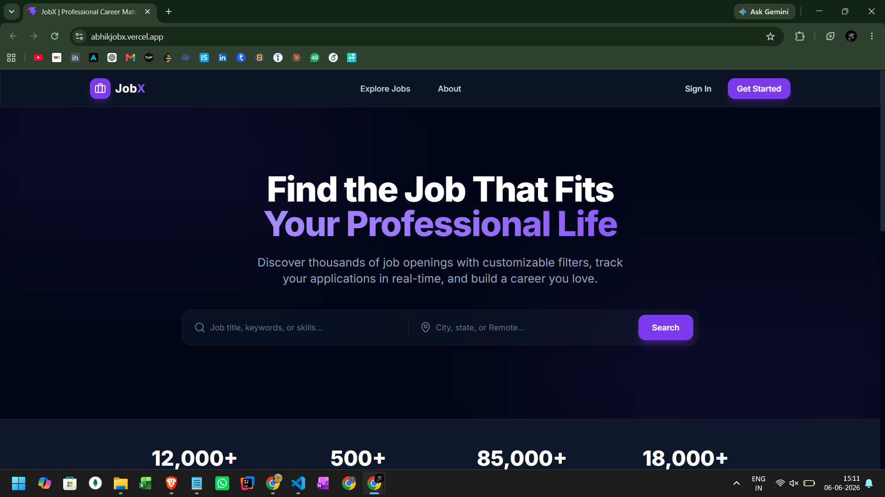
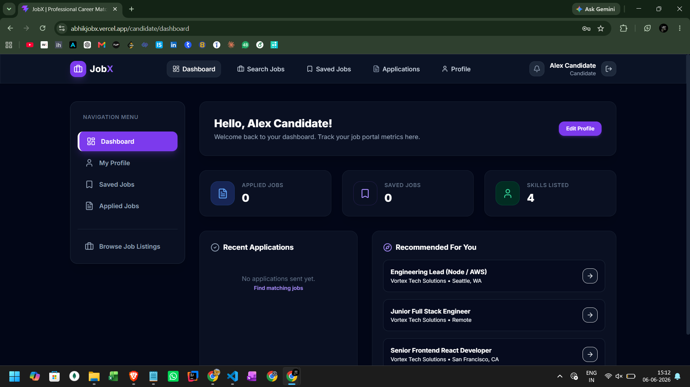
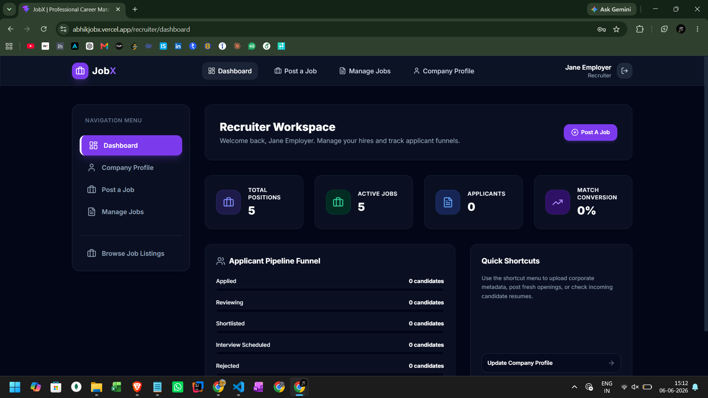
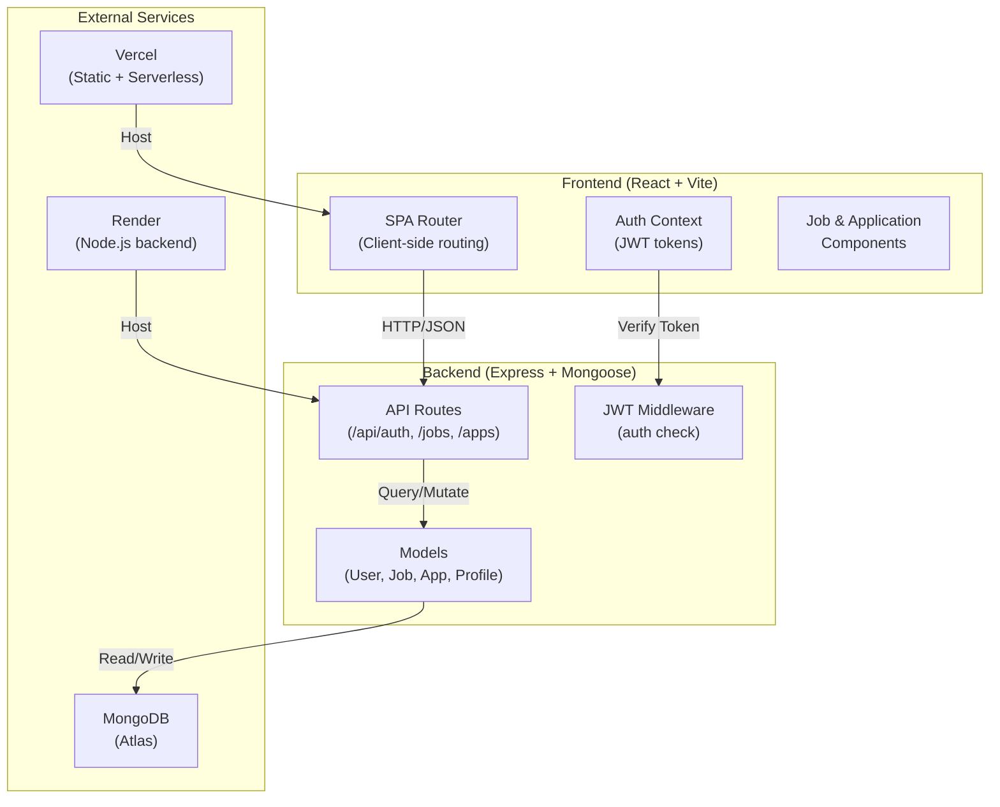
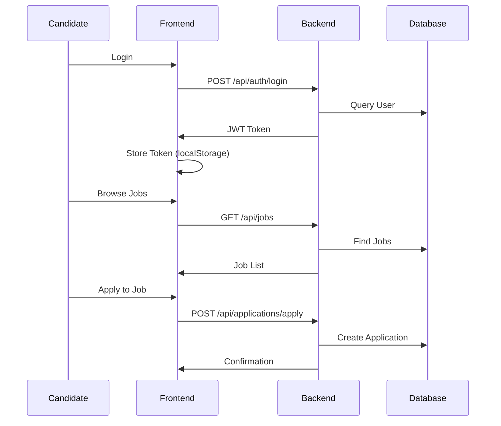

# JobX — Full-Stack Job Portal

One-line: Full-stack job portal demonstrating SPA routing, serverless-ready API, CI/CD automation, and seeded demo workflow.

This README documents the project, development setup, CI/CD approach, seed data, deployment notes, architecture, and API surface for quick evaluation.

---

## Table of Contents

- Project Summary
- Quick Demo & Badges
- Screenshots & Diagrams
- Why This Project (Reviewer Highlights)
- Tech Stack
- Architecture & Design Decisions
- Directory Structure
- Setup (Local Development)
- Seed Data & Default Accounts
- CI/CD & Deployment (Vercel + Optional Render)
- Environment Variables
- Running Tests & Linting
- API Reference (short)
- Database Schemas
- Troubleshooting & Common Fixes
- Security Notes
- Contribution, Contact, License

---

## Project Summary

JobX is an end-to-end job board with distinct Candidate and Recruiter workspaces. Candidates can build a profile (with resume upload), search and apply for jobs, and track applications. Recruiters can post roles, review applicants, and manage hiring pipelines.

Key goals:
- Fast reviewer onboarding: seed data + demo accounts
- Production similarity: build output (`frontend/dist`) deployed to Vercel
- Developer ergonomics: monorepo with workspace scripts for quick start
- Secure-by-default: hashed passwords and JWT authentication

---

## Quick Demo & Badges

- Live demo: https://abhikjobx.vercel.app/
- Backend API base URL: https://jobboard-backend-fh9f.onrender.com/api
- Demo accounts (created by `npm run seed`):
  - Recruiter: `recruiter@example.com` / `password123`
  - Candidate: `candidate@example.com` / `password123`

Add your real links for CI and Vercel badges above.

---

## Screenshots & Diagrams

## Screenshots

#### Home Page


#### Recruiter Dashboard


*Recruiter can post jobs, manage applicants, and track hiring pipeline.*

#### Candidate Dashboard


*Candidate can search jobs, filter jobs, get notification of new jobs, apply, and track application status.*

### Architecture Diagram



### Data Flow



---

## Why This Project (Reviewer Highlights)

- Monorepo layout (root `package.json` with `frontend` and `backend` workspaces) demonstrates scalable developer workflows.
- SPA routing issues (404 on refresh) are solved via `vercel.json` / `frontend/vercel.json` rewrites to `index.html`.
- Express API is exported from `backend/index.js` for serverless compatibility with Vercel.
- CI pipeline builds assets and deploys automatically; optional Render webhook provides multi-host deploy support.
- Seeded data and scriptable setup make hands-on verification fast.

---

## Tech Stack

- Frontend: React (Vite), React Router DOM (v7), Tailwind CSS
- Backend: Node.js, Express.js, Mongoose (MongoDB)
- Auth: JWT (access tokens), bcrypt for password hashing
- CI/CD: GitHub Actions, Vercel (static + serverless), optional Render webhook
- Dev tooling: ESLint, Prettier, Vite

---

## Architecture & Design Decisions

- SPA + Static Hosting: Frontend is a Vite-built SPA served as static files; client routing requires server fallback to `index.html` (implemented in `vercel.json`).
- Serverless-capable API: `backend/index.js` exports the Express `app` so platform adapters can import it as a serverless function. When running locally `npm run dev-backend` starts the server.
- Data model: Minimal normalized documents (`User`, `Profile`, `Job`, `Application`) using Mongoose schemas for clarity and quick iteration.
- File uploads: To remain serverless-friendly, file uploads are stored as Base64 blobs in DB for this demo; production should use object storage (S3/Cloud Storage) and reference URIs.

Tradeoffs:
- Base64 in DB simplifies demonstration and review but isn't ideal for production due to DB size and performance.

---

## Directory Structure (high level)

- `frontend/` — Vite React app (source in `frontend/src`)
- `backend/` — Express API & models
- `vercel.json` — root Vercel config when deploying repository root
- `frontend/vercel.json` — project root override if deploying only `frontend/`
- `.github/workflows/deploy.yml` — CI pipeline
- `implementation_plan.md` — project notes and decisions

---

## Setup (Local Development)

Prerequisites:
- Node.js 18+ (or recommended LTS)
- MongoDB (local or Atlas)

Commands (Windows PowerShell / WSL / macOS):

```bash
# from repository root
npm run install-all

# copy example env and configure
copy backend\.env.example backend\.env
# edit backend\.env -> set MONGODB_URI and JWT_SECRET

# seed demo data
npm run seed

# start backend (port 5000)
npm run dev-backend

# start frontend (Vite dev server)
npm run dev-frontend
```

Open `http://localhost:5173` and log in with seed accounts.

Production preview (build + preview):

```bash
# build frontend
npm run build-frontend

# preview static site from frontend/dist
npm --prefix frontend run preview
```

---

## Seed Data & Default Accounts

- Seed script: `backend/seed.js` (invoked by `npm run seed`)
- What seed includes:
  - 1 Recruiter account: `recruiter@example.com` / `password123`
  - 1 Candidate account: `candidate@example.com` / `password123`
  - Several sample jobs with varying experience levels and locations
- Purpose: allow reviewers to exercise end-to-end flows without manual setup

Notes: Change seeded passwords and remove demo data before production use.

---

## CI/CD & Deployment (Detailed)

Goal: fast, repeatable deploys with optional multi-host rollout.

Pipeline summary (`.github/workflows/deploy.yml`):
1. Checkout repository and install dependencies (monorepo-aware)
2. Run backend lint/static checks
3. Build frontend (`npm run build-frontend` -> builds `frontend/dist`)
4. Deploy to Vercel via `npx vercel --prod` using secrets: `VERCEL_TOKEN`, `VERCEL_ORG_ID`, `VERCEL_PROJECT_ID`
5. (Optional) POST to `RENDER_DEPLOY_HOOK_URL` to trigger Render deploy for a secondary environment

Why this approach:
- Vercel handles static hosting and serverless API functions; build artifacts are deterministic.
- Optional Render webhook allows a staging/secondary environment without duplicating build steps.

Key config files:
- `vercel.json` (root): instructs Vercel how to build and the SPA rewrite
- `frontend/vercel.json`: used when Vercel is pointed at `frontend/` as the project root

Secrets required in GitHub Actions (repository secrets):
- `VERCEL_TOKEN`, `VERCEL_ORG_ID`, `VERCEL_PROJECT_ID` — Vercel credentials
- `RENDER_DEPLOY_HOOK_URL` — optional
- `MONGODB_URI`, `JWT_SECRET` — production credentials

Common CI problems & fixes:
- "Missing script: build-frontend" — ensure `frontend/vercel.json` exists when Vercel uses `frontend/` as root, or configure root `vercel.json` correctly.
- 404 on page refresh — ensure SPA rewrite to `index.html` is present in `vercel.json`.

---

## Environment Variables

Backend (`backend/.env`)

```
PORT=5000
MONGODB_URI=<your_mongodb_uri>
JWT_SECRET=<strong_jwt_secret>
JWT_EXPIRE=30d
NODE_ENV=development
```

CI / Production (store in GitHub / Vercel / Render secrets):
- `VERCEL_TOKEN`, `VERCEL_ORG_ID`, `VERCEL_PROJECT_ID`
- `RENDER_DEPLOY_HOOK_URL` (optional)
- `MONGODB_URI`, `JWT_SECRET`

---

## Running Tests & Linting

(If present) Run linter/tests:

```bash
npm --prefix backend run build
npm --prefix frontend run lint
# add tests when available
```

Note: the backend currently does not expose a dedicated lint script; `npm --prefix backend run build` validates the Node.js server code.

---

## API Reference (selected)

Authenticate:

```bash
POST /api/auth/login
# body: { "email": "...", "password": "..." }
```

Public Jobs:

```bash
GET /api/jobs
GET /api/jobs/:id
```

Applications:

```bash
POST /api/applications/apply/:jobId  # requires auth
GET /api/applications/my-applications
```

See full endpoints in `backend/routes/`.

Example (curl):

```bash
curl -X POST https://jobboard-backend-fh9f.onrender.com/api/auth/login \
  -H "Content-Type: application/json" \
  -d '{"email":"recruiter@example.com","password":"password123"}'
```

---

## Database Schemas (summary)

- `User` — name, email, password (hashed), role
- `Profile` — userId, skills, experience[], education[], resume (base64)
- `Job` — recruiterId, title, description, requirements[], location, salaryRange
- `Application` — jobId, candidateId, status, resume (base64), coverLetter

---

## Troubleshooting & Common Fixes

- SPA refresh 404: add rewrite in `vercel.json`:

```json
{"rewrites":[{"source":"/(.*)","destination":"/index.html"}]}
```

- Vercel ignoring `vercel.json`: ensure the config is inside the deployment root (repo root vs `frontend/`).
- Invalid Vercel token in CI: recreate token via `vercel login` and update GitHub secret.

---

## Security Notes

- Password hashing: bcrypt (backend)
- JWT: tokens signed with `JWT_SECRET`; rotate and protect this secret in production
- File uploads: currently stored as Base64 to simplify review; migrate to object storage for production

---

## Known Limitations & Future Work

- Resume storage in DB (Base64) — move to S3/Cloud Storage and store references instead
- AI based resume score 
- Add comprehensive unit/integration tests
- Add RBAC enforcement tests and stricter rate limiting

---

## License

MIT License — see the `LICENSE` file.

---

## Contribution, Contact

Found a bug or want to propose an improvement? Open an issue or PR.

Contact: abhiksamanta20@gmail.com

License: MIT


*** End of README
