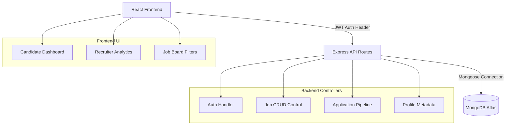

# JobX | Full-Stack Job Portal

A production-quality full-stack Job Board application designed with a premium modern SaaS aesthetic. Built with React.js, Node.js Express, Tailwind CSS, and MongoDB.

---

## Project Overview

JobX is a complete job matchmaking portal designed with dedicated workspaces for Candidates (to manage resume profiles, search matching listings, bookmark posts, and submit applications) and Recruiters (to post vacancies, manage applicant pipelines, screen portfolios, and  review recruitment funnel statistics) .

---

## Features

### Candidate Features
* **Personalized Dashboard**: High-level application statistics, bookmarked role trackers, and automated role recommendations matched against listed candidate skills.
* **Interactive Profile Builder**: Comma-delimited skill tags, interactive arrays to manage work experience and education history, profile avatar uploading, and PDF resume uploading.
* **Fuzzy Job Search & Filters**: Multi-parameter filters including workplace type (remote/onsite/hybrid), experience levels (entry/mid/senior/lead), job types, and minimum annual salaries.
* **Application Overlay**: A cover letter submission prompt featuring toggles to attach the profile resume or upload a custom application PDF.
* **Bookmarks & Saved List**: Quick saved toggles persisted to local storage for candidates.

### Recruiter Features
* **Recruiter Analytics Dashboard**: KPI metrics for views, conversion rates (applications vs views), active postings, and applicant status breakdown charts.
* **Company Profiles**: Upload company logo, industry category, employee headcount, corporate description, and website.
* **Job Posting & Edit Wizard**: Fields for title, descriptions, salary ranges, workplace constraints, required skills lists, responsibilities, and perks.
* **Application Management Pipeline**: Status change dropdowns ('Reviewing', 'Shortlisted', 'Interview Scheduled', 'Rejected', 'Selected') and in-browser Base64 PDF resume viewer.

### Security & UX Enhancements
* **Session Persistence**: JWT-based session security storing tokens in local state and auto-loading sessions.
* **Form validation**: Complete error boundaries on inputs.
* **Toast Notification System**: Dynamic custom-styled notifications for successes, errors, and informational status changes.
* **Skeleton Loaders**: Modern pulsed loading cards and table rows.

---

## Architecture Diagram



---

## Tech Stack

* **Frontend**: React.js, Vite, Tailwind CSS, Lucide Icons, React Router DOM
* **Backend**: Node.js, Express.js
* **Database**: MongoDB (Mongoose ODM)
* **Auth**: JSON Web Tokens (JWT), Bcrypt.js password hashing
* **CI/CD**: GitHub Actions, Vercel CLI

---

## Database Schemas

### User Model
```json
{
  "name": "String (required)",
  "email": "String (required, unique)",
  "password": "String (required, encrypted)",
  "role": "String (candidate | recruiter)"
}
```

### Profile Model
```json
{
  "userId": "ObjectId (ref User)",
  "role": "String",
  "skills": "Array of Strings",
  "experience": [{
    "title": "String",
    "company": "String",
    "duration": "String",
    "description": "String"
  }],
  "education": [{
    "school": "String",
    "degree": "String",
    "field": "String",
    "year": "String"
  }],
  "resume": "String (Base64 PDF snapshot)",
  "resumeName": "String",
  "avatar": "String (Base64 Image)",
  "companyName": "String",
  "companyLogo": "String (Base64 Logo)",
  "website": "String",
  "industry": "String",
  "companySize": "String",
  "description": "String"
}
```

### Job Model
```json
{
  "recruiterId": "ObjectId (ref User)",
  "title": "String",
  "companyName": "String",
  "companyLogo": "String",
  "description": "String",
  "requirements": "Array of Strings",
  "responsibilities": "Array of Strings",
  "benefits": "Array of Strings",
  "location": "String",
  "salaryRange": { "min": "Number", "max": "Number" },
  "jobType": "String (Full-time | Part-time | Contract | Internship)",
  "workplaceType": "String (Onsite | Remote | Hybrid)",
  "experienceLevel": "String (Entry-level | Mid-level | Senior | Lead)",
  "isActive": "Boolean (default: true)",
  "views": "Number (default: 0)",
  "createdAt": "Date"
}
```

### Application Model
```json
{
  "jobId": "ObjectId (ref Job)",
  "candidateId": "ObjectId (ref User)",
  "status": "String (Applied | Reviewing | Shortlisted | Interview Scheduled | Selected | Rejected)",
  "resume": "String (Base64 PDF snapshot)",
  "resumeName": "String",
  "coverLetter": "String",
  "appliedAt": "Date"
}
```

---

## Installation Guide

### Prerequisites
* Node.js (v18+ recommended)
* MongoDB (Local instance or MongoDB Atlas cluster connection string)

### 1. Clone the project and install workspace packages
```bash
# Run command from root folder
npm run install-all
```

### 2. Configure Backend Variables
Create a file at `backend/.env`:
```env
PORT=5000
MONGODB_URI=your_mongodb_connection_uri
JWT_SECRET=your_jwt_signing_key_here
JWT_EXPIRE=30d
NODE_ENV=development
```

### 3. Run the Database Seed
Pre-populate the database with a Candidate, a Recruiter (password `password123`), and 5 sample jobs:
```bash
# Run from root folder
npm run seed
```

### 4. Boot Development Servers
```bash
# Terminal 1 - Start Backend API
npm run dev-backend

# Terminal 2 - Start Frontend Web App
npm run dev-frontend
```

---

## API Documentation

### Auth Endpoints (`/api/auth`)
* `POST /register`: Registers user and generates session token.
* `POST /login`: Logs in and returns user payload + JWT.
* `GET /me`: Private. Returns current session details and profile.

### Jobs Endpoints (`/api/jobs`)
* `GET /`: Public. Queries matching active job listings.
* `GET /:id`: Public. Returns job details and increments views.
* `GET /my-jobs`: Recruiter. Returns jobs posted by the logged-in user.
* `POST /`: Recruiter. Creates a new job posting.
* `PUT /:id`: Recruiter. Edits a job posting (owner-validated).
* `DELETE /:id`: Recruiter. Deletes a job listing.

### Profiles Endpoints (`/api/profiles`)
* `GET /`: Private. Returns authenticated user profile.
* `PUT /`: Private. Updates candidate resume details or recruiter corporate tags.

### Applications Endpoints (`/api/applications`)
* `POST /apply/:jobId`: Candidate. Submits a job application.
* `GET /my-applications`: Candidate. Returns applied listings.
* `DELETE /withdraw/:id`: Candidate. Withdraws an active application.
* `GET /job/:jobId`: Recruiter. Lists all applicants for a job (populates portfolios).
* `PUT /status/:id`: Recruiter. Changes applicant status pipeline stages.
* `GET /stats/recruiter`: Recruiter. Returns dashboard KPI statistics.

### Notifications Endpoints (`/api/notifications`)
* `GET /`: Candidate. Returns unread notifications logs (matching roles/status updates).
* `PUT /:id/read`: Candidate. Marks a specific notification as read.
* `DELETE /`: Candidate. Clears all notification logs.

---

## CI/CD Workflow & Deployment

### GitHub Actions Pipeline
The project includes a `.github/workflows/deploy.yml` pipeline that triggers on pushes to the `main` branch. It:
1. Installs monorepo workspace dependencies.
2. Checks backend code syntax.
3. Builds the static production React assets using Vite.
4. Auto-deploys to Vercel using environment secret parameters.

### Vercel Deployment Settings
Deploy directly to Vercel using the configured root `vercel.json` rewrite bindings:
* Configure these environment secrets on your repository / Vercel project:
  * `VERCEL_TOKEN`: Vercel Personal Access Token
  * `VERCEL_ORG_ID`: Vercel Organization ID
  * `VERCEL_PROJECT_ID`: Vercel Project ID
  * `MONGODB_URI`: Production MongoDB Atlas URI
  * `JWT_SECRET`: Secure encryption key

---

## AI Usage Section

AI was utilized to accelerate the engineering of this application:
* **UI/UX Design Brainstorming**: Ideating on dark-themed SaaS dashboards and visual cards.
* **Component Architecture Planning**: Designing context bindings to coordinate state across candidate search lists and recruiter applicants panels.
* **Workflow Automation**: Writing the `.github/workflows/deploy.yml` and `vercel.json` routing configurations.
* **Seed Mocking**: Developing clean mock data structures for database initialization.
